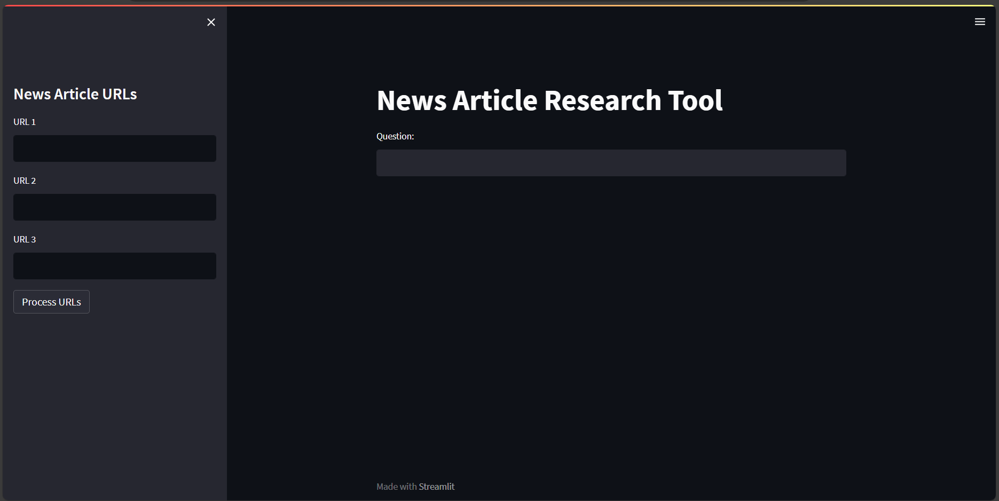

# News Article Research Tool

## Overview

The News Article Research Tool is a web application designed to facilitate research on news articles using Generative AI and Natural Language Processing (NLP) techniques. It allows users to input URLs of news articles, ask questions related to the content of those articles, and receive detailed answers along with the sources.



## Features

- **URL Input:** Users can input multiple news article URLs.
- **Data Processing:** The tool fetches and processes the article content.
- **Text Splitting & Embedding:** Articles are split into manageable chunks, and embeddings are generated using OpenAI's state-of-the-art models.
- **Query Answering:** Users can ask questions, and the tool retrieves and displays relevant answers along with their sources.

## Technologies Used

- **Python**: Programming language used for backend development.
- **Streamlit**: Web application framework used for the user interface.
- **LangChain**: Python library for document processing and querying.
- **OpenAI GPT-3.5 Turbo**: State-of-the-art language model used for generating responses.
- **FAISS**: Library for efficient similarity search.
- **dotenv**: Library for loading environment variables from .env file.

  ## Why Use This News Article Research Tool?

- **Efficiency**: Copy-pasting articles into ChatGPT for analysis can be tedious and time-consuming. This tool automates the process, allowing for quick and efficient analysis of multiple articles simultaneously.

- **Aggregate Knowledge Base**: By inputting multiple news article URLs, users can build an aggregate knowledge base on a particular topic. This allows for a comprehensive understanding of various perspectives and insights from different sources.

- **No Word Limit**: Unlike some chat-based AI models like ChatGPT, this tool does not have a word limit. Users can ask detailed questions and receive comprehensive answers without being constrained by character limits or word counts.

- **Cost-Effective**: With the availability of powerful AI models like ChatGPT 4 being limited or requiring a subscription, this tool provides a cost-effective alternative for conducting research and analysis on news articles.

- **User-Friendly Interface**: The Streamlit-based user interface makes it easy for users to interact with the tool, providing a seamless experience for inputting URLs, asking questions, and viewing answers and sources.

By leveraging the capabilities of Generative AI and Natural Language Processing, this News Article Research Tool offers a more efficient, cost-effective, and user-friendly solution for analyzing news articles and gathering insights.


## Getting Started

### Prerequisites

- Python 3.x installed on your system
- pip package manager

### Installation

1. Clone the repository:

 ```bash
 git clone https://github.com/uvinduuu/researchTool.git
 ```
   
2. Navigate to the project directory:

```bash
cd news-article-research-tool
```

3. Install dependencies:

```bash
pip install -r requirements.txt
```

### Usage

1. Run the Streamlit application:

```bash
streamlit run main.py
```
#### Acknowledgements
*Thanks to OpenAI for providing the GPT-3.5 Turbo model.*
*Thanks to the creators of LangChain for the useful library.*


